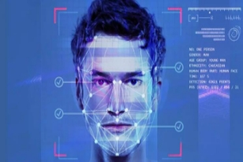

Driver’s drowsiness is one of the reasons for many road accidents worldwide. In this paper, we have proposed an approach for detecting and predicting the driver’s drowsiness based on facial features. Our methodology centers on the utilization of convolutional neural networks (CNNs), renowned for their effectiveness in image classification tasks. We employ transfer learning techniques to leverage pre-trained models on large image datasets, facilitating model optimization for drowsiness detection. Through meticulous experimentation and finetuning, we optimize the models to achieve superior accuracy in drowsiness detection. A comparison between the methods based on model size, accuracy, and training time has also been made. The extracted model can achieve an accuracy of more than 96% and can be saved as a file and used to classify images as driver’s Drowsy or Non-Drowsy with the predicted label and probabilities for each class.

 
The **Classification**  implementation involves sophisticated algorithms like Random Forest, Supported Vector Machines, K-Nearest  Neighbours,  and  CNN  Model,  that proactively  alert  drivers,  aiming  to  prevent accidents  caused  by  fatigue.  This  exploration marks a transformative step toward enhancing road safety through innovative technological solutions.  

1) ***Introduction  to  the  System**:*  This implementation  is  to  create  an  advanced monitoring  system  that  can  analyze  facial expressions in real time to detect signs of driver drowsiness.  By  harnessing  the  capabilities  of Python, a versatile and widely-used programming language, and integrating them with sophisticated facial recognition algorithms, the system aims to provide  timely  alerts  to  drivers,  preventing potential  accidents  caused  by  fatigue.

2) ***Technical  details**:*  The  implementation involves leveraging Python’s versatility for real- time data processing and analysis. Advanced facial recognition  algorithms  scrutinize  key  features, including eye closure and yawning patterns. 

1) ***Data Acquisition**:* The System begins  by  capturing  live  data  from  the  driver, primarily  focusing  on  facial  and  eye  features relevant to drowsiness detection. This involves the use of cameras or sensors strategically positioned to capture facial expressions.  

  

*Fig. 1.  This is a figure of Face acquisition using a camera sensor.* 

2) ***Pre-processing**:* The  acquired data  undergoes  pre-processing  to  enhance  its quality and prepare it for analysis. This phase may involve tasks such as: filtering,  we  deftly  expunge  extraneous noise, fostering a pristine canvas upon which critical  facial  cues  associated  with drowsiness can be discerned with clarity and precision.  This  meticulous  noise  reduction process not only enhances the fidelity of our analysis  but  also  imbues  our  model  with heightened sensitivity to subtle variations in driver alertness. 

- *Image enhancement.* 

  Continuing our quest for perceptual clarity, we  enlist  the  aid  of  advanced  image enhancement  techniques,  finely  attuned  to Accentuate the salient facial and eye features indicative  of  drowsiness.  Employing methods such as histogram equalization or adaptive contrast enhancement, we bestow upon  our  images  a  newfound  vibrancy, amplifying  the  prominence  of  crucial landmarks  such  as  eyelid  closure  or droopiness.  By  enhancing  contrast  and sharpness,  we  furnish  our  model  with  a discerning eye, enabling it to discern even the most subtle manifestations of drowsiness amidst a sea of visual stimuli.  

- *Normalization to ensure consistency.* 

  Harmosing the descriptive nuances inherent in diverse datasets is pivotal for ensuring the robustness  of  our  drowsiness  detection framework. To this end, we invoke the power of  normalization  techniques,  meticulously calibrating  pixel  intensities  and  spatial dimensions to a uniform scale. By aligning our data with a common reference frame, we mitigate  potential  biases  and  variations, fostering  model  generalization  across  a spectrum of environmental conditions. This strategic normalization not only primes our model for effective training but also fortifies its resilience to fluctuations in lighting, pose, or facial expressions, thus fortifying its real- world applicability and dependability, Noise reduction.
  
- c)  **Facial  Feature  Extraction**:* In our preprocessing pipeline, we employ an  The  advanced  facial  recognition  algorithms advanced  noise  reduction  algorithm  to  analyze  the  pre-processed  data  to  extract  key effectively mitigate unwanted artifacts and  features  indicative  of  drowsiness,  such  as  eye disturbances  present in the input images.  closure  duration,  frequency  of  blinking,  and Through  the  judicious  application  of  yawning patterns and techniques  such  as  Gaussian  or  median 

  

*Fig. 2.    This is the figure of Facial Feature Extraction* 

3) ***Importance**:* To address persistent driver drowsiness issues during prolonged or nocturnal driving, this project introduces the Detection of Drowsiness in Drivers using Python rogramming by Facial Recognition. Leveraging AI and ML, the goal  is  real-time  monitoring,  proactive  alerting, and accident prevention through facial expression analysis. 

HOW EFFECTIVELY DOES THE SYSTEM PERFORM IN PRACTICE? 

4) ***Drowsiness  Classification**:* In checking how our Detection system performs, We’ve run it through various tests and real-life based  on  the  extracted  features,  the  system  situations.  The  results  show  that  the  system  is classifies the driver’s current state such as: alert,  pretty sharp at recognizing when a driver is getting drowsy, or fatigued.  drowsy. We looked at numbers like sensitivity and specificity to make sure it’s good at telling the difference between an alert driver and one who’s feeling a bit too sleepy. The outcome? A reliable system that catches those subtle signs of driver fatigue.

  

RELATED WORK **DATASET COLLECTION** 

In the realm of detecting driver fatigue, a plethora of methodologies have been explored, constituting an  ongoing  area  of  research.  This  section *Fig. 3. This is the figure of Drowsiness Classification*  delineates the pertinent investigations undertaken by various scholars to discern the signs of driver 

5) ***Alert Generation**:* In the event  drowsiness.  As  integral  to  this  endeavor  is  the of  detecting  signs  of  drowsiness,  the  system  collection of datasets from drivers, a pivotal aspect generates timely alerts to the driver. These alerts  often fraught with challenges. Many researchers may include visual indicators, auditory warnings,  have  traditionally  relied  upon  either  captured or  haptic  feedback,  depending  on  the  images or live camera feeds to delineate drowsy implementation’s design.  from  non-drowsy  states.  

  

However,  a  paradigm shift emerges with the work of “Bhargava Veera Bhadra  Guduru”,  who  introduces  a  novel technique.  Guduru’s  innovation  involves  the capture and classification of images at five-second intervals  to  ascertain  the  presence  of  fatigue. Notably, images identified as depicting drowsiness are stored in a designated “Drowsy” folder, while those indicating alertness are allocated to a “Non- Drowsy”  repository.  It  is  pertinent  to  note  that ***Guduru’s***  methodology  also  incorporates  a  fail- safe mechanism, wherein the camera activates for image capture if the designated folder is devoid of any images. This innovative approach underscores the continual evolution and refinement within the realm  of  drowsiness  detection  research, showcasing the ingenuity and adaptability inherent in scientific inquiry. 

To find out the best results on a machine learning classifier for the detection of drowsiness in drivers on different facial features that are carried out. Once the confusion matrix is formed, we identify the “True Positive [TP], True Negative [TN], False Positive [ FP], and Fales Negative [FN] evaluations are computed through the following formulae. 

                                              TPR = TP / FN + TP --------------[1] 

                                              FPR = FP/ TN + FP ----------------[2] 

                                           Accuracy = [TP + TN] / [TP + TN + FP + FN] 

                                                  Precision = TP / FP + TP 

represents the weights, ‘x’ denotes the input, and ‘b’ is the bias term. 

In K-Nearest Neighbors (KNN), where ‘ ’ is the predicted output for a new instance,  ‘K’  is  the number of nearest neighbors, and ‘ ’ represents the labels of the k-nearest neighbors. 

***FEASIBILITY STUDY***

In addition to its technical prowess and operational seamlessness, our Detection of Drowsiness project boasts a strategic approach to economic viability and societal impact. Having scrutinized the feasibility of our Drowsiness Detection project, we find it to be technically robust, harnessing the cutting-edge capabilities of artificial intelligence, machine learning, Python programming, and facial recognition technology. Operationally, it seamlessly integrates into existing driving configurations, ensuring a smooth and unobtrusive user experience.

Economically, our evaluation weighs the costs against the benefits with precision and pragmatism. While there may be initial investments required for infrastructure, software, and deployment, the enduring advantages in terms of accident prevention and enhanced road safety far outweigh these expenditures. By curbing the incidence of accidents triggered by driver drowsiness, our solution not only delivers tangible savings in healthcare expenses and property damage but also preserves the invaluable human capital that drives our economy forward. Moreover, the societal benefits are immeasurable, as families are shielded from the heartache of loss, and communities are fortified against the ripple effects of road tragedies.

<h3> CONCLUSION </h3>

In summation, the endeavor to detect and address driver drowsiness through innovative technologies represents a significant advancement in the realm of road safety. The fusion of Artificial Intelligence (AI) and Machine Learning (ML) has birthed a sophisticated  apparatus  adept  at  real-time monitoring and nuanced analysis of driver facial cues, facilitating timely intervention to avert the perils  of  fatigue-induced  accidents.  Rigorous testing and scrutiny have underscored the prowess of our chosen algorithms be it the robust Random Forest, the discerning Supported Vector Machines, the insightful K-Nearest Neighbors, or the intricate CNN Model - in detecting even the subtlest hints of drowsiness. This accomplishment heralds the indispensable  role  of  advanced  technologies  in preserving lives and fostering a culture of safer driving practices. Amidst the dynamic landscape of  road  safety,  our  project  serves  as  a  beacon, illuminating  the  transformative  potential  of technological  innovation  in  nurturing  a  road environment that is secure and sustainable for all travelers. 

